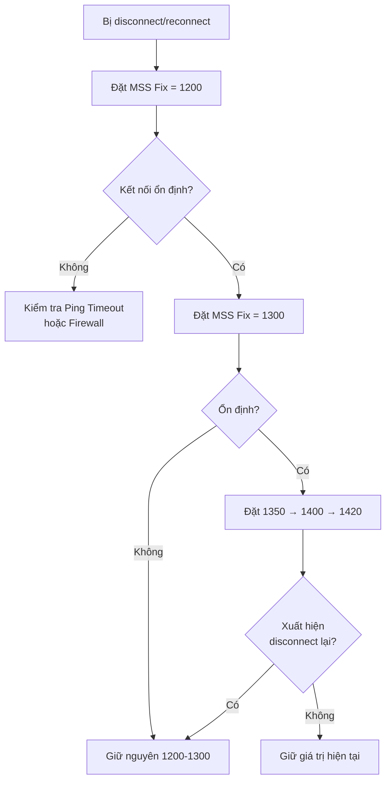

# Hướng dẫn cài đặt và cấu hình Pritunl VPN Server & Client

## Mục lục

1. [Cài đặt Pritunl Server trên Ubuntu 24.04 LTS](#1-cài-đặt-pritunl-server-trên-ubuntu-2404-lts)
2. [Cài đặt Pritunl Server trên Oracle Linux 9](#2-cài-đặt-pritunl-server-trên-oracle-linux-9)
3. [Cấu hình ban đầu (Web UI)](#3-cấu-hình-ban-đầu-web-ui)
4. [Cấu hình Routes (Split-Tunneling)](#4-cấu-hình-routes-split-tunneling)
5. [Cấu hình Pritunl Client Windows](#5-cấu-hình-pritunl-client-windows)
6. [Troubleshooting - Mất Internet khi bật VPN](#6-troubleshooting---mất-internet-khi-bật-vpn)
7. [Troubleshooting - Disconnect/Reconnect liên tục](#7-troubleshooting---disconnectreconnect-liên-tục)
8. [Troubleshooting - Let's Encrypt SSL](#8-troubleshooting---lets-encrypt-ssl)
9. [Logs và Debug](#9-logs-và-debug)

---

## 1. Cài đặt Pritunl Server trên Ubuntu 24.04 LTS

### Yêu cầu
- Ubuntu 24.04 LTS (Noble) - clean install
- RAM tối thiểu: 2GB (khuyến nghị 4GB+)
- IP public tĩnh (hoặc NAT với port forwarding)
- Firewall mở các cổng: `22`, `443`, `1194/udp` (OpenVPN), `51820/udp` (WireGuard)

### Cách 1: Dùng script tự động

```bash
# Copy script lên server, cấp quyền và chạy
chmod +x vpnenterprise-ubuntu24.sh
sudo ./vpnenterprise-ubuntu24.sh
```

### Cách 2: Cài thủ công từng bước

```bash
# 1. Cập nhật hệ thống
sudo apt update && sudo apt upgrade -y
sudo apt install -y curl gnupg2 wget unzip software-properties-common

# 2. Thêm GPG keys (dùng gpg --dearmor thay vì apt-key deprecated)
curl -fsSL https://www.mongodb.org/static/pgp/server-8.0.asc \
  | sudo gpg -o /usr/share/keyrings/mongodb-server-8.0.gpg --dearmor --yes

curl -fsSL https://swupdate.openvpn.net/repos/repo-public.gpg \
  | sudo gpg -o /usr/share/keyrings/openvpn-repo.gpg --dearmor --yes

curl -fsSL https://raw.githubusercontent.com/pritunl/pgp/master/pritunl_repo_pub.asc \
  | sudo gpg -o /usr/share/keyrings/pritunl.gpg --dearmor --yes

# 3. Thêm repositories cho Ubuntu 24.04 (noble)
sudo tee /etc/apt/sources.list.d/mongodb-org.list << EOF
deb [ signed-by=/usr/share/keyrings/mongodb-server-8.0.gpg ] https://repo.mongodb.org/apt/ubuntu noble/mongodb-org/8.0 multiverse
EOF

sudo tee /etc/apt/sources.list.d/openvpn.list << EOF
deb [ signed-by=/usr/share/keyrings/openvpn-repo.gpg ] https://build.openvpn.net/debian/openvpn/stable noble main
EOF

sudo tee /etc/apt/sources.list.d/pritunl.list << EOF
deb [ signed-by=/usr/share/keyrings/pritunl.gpg ] https://repo.pritunl.com/stable/apt noble main
EOF

# 4. Cài đặt
sudo apt update
sudo apt install -y pritunl openvpn mongodb-org wireguard wireguard-tools

# 5. Start services
sudo systemctl start mongod pritunl
sudo systemctl enable mongod pritunl
```

### Cấu hình Firewall (UFW)

```bash
# KHÔNG bật UFW nếu dùng Pritunl (Pritunl tự quản lý iptables)
# Nếu bắt buộc dùng UFW:
sudo ufw disable
```

> **Lưu ý quan trọng**: Pritunl tự quản lý iptables rules. Nếu dùng UFW hoặc firewalld, có thể gây xung đột. Khuyến nghị **tắt UFW** (`sudo ufw disable`).

---

## 2. Cài đặt Pritunl Server trên Oracle Linux 9

```bash
# 1. Thêm repository MongoDB 8.0
sudo tee /etc/yum.repos.d/mongodb-org.repo << EOF
[mongodb-org-8.0]
name=MongoDB Repository
baseurl=https://repo.mongodb.org/yum/redhat/9/mongodb-org/8.0/x86_64/
gpgcheck=1
enabled=1
gpgkey=https://pgp.mongodb.com/server-8.0.asc
EOF

# 2. Thêm repository Pritunl
sudo tee /etc/yum.repos.d/pritunl.repo << EOF
[pritunl]
name=Pritunl Repository
baseurl=https://repo.pritunl.com/stable/yum/oraclelinux/9/
gpgcheck=1
enabled=1
gpgkey=https://raw.githubusercontent.com/pritunl/pgp/master/pritunl_repo_pub.asc
EOF

# 3. Tắt firewalld (xung đột với iptables của Pritunl)
sudo dnf -y remove iptables-services
sudo systemctl stop firewalld.service
sudo systemctl disable firewalld.service

# 4. Cài đặt
sudo dnf -y update
sudo dnf -y install pritunl pritunl-openvpn wireguard-tools mongodb-org

# 5. Start services
sudo systemctl enable mongod pritunl
sudo systemctl start mongod pritunl
```

---

## 3. Cấu hình ban đầu (Web UI)

Sau khi cài xong, truy cập: `https://<IP_SERVER>`

### Bước 1: Lấy setup-key
```bash
sudo pritunl setup-key
```
Nhập key này vào trình duyệt.

### Bước 2: Lấy mật khẩu mặc định
```bash
sudo pritunl default-password
```
Đăng nhập với username: `pritunl` và password nhận được. Đổi mật khẩu ngay sau đó.

### Bước 3: Tạo Organization & User
- **Users** → **Add Organization** → Đặt tên (VD: `my-org`)
- **Add User** → Nhập Name, Email (tùy chọn), PIN (tùy chọn)

### Bước 4: Tạo Server
- **Servers** → **Add Server**
- Cấu hình:
  - **Port**: để random hoặc chọn cố định
  - **Protocol**: `udp` (khuyến nghị)
  - **Virtual Network**: `10.10.10.0/24` (OpenVPN)
  - **Virtual WG Network**: `10.11.11.0/24` (WireGuard)
  - **DNS Server**: `8.8.8.8`
- **Attach Organization** → chọn organization vừa tạo
- **Start Server**

### Bước 5: Download profile
- **Users** → click icon download bên cạnh user → chọn định dạng `.pritunl` hoặc `.ovpn`

---

## 4. Cấu hình Routes (Split-Tunneling)

**Split-Tunneling** cho phép vừa truy cập VPN vừa dùng internet thường qua Wi-Fi.

### Cấu hình trên Web UI (Servers → chọn server → Routes)

| Action | Chi tiết |
|--------|----------|
| **XÓA** `0.0.0.0/0` | Route này bắt buộc **toàn bộ** traffic qua VPN → mất internet cục bộ |
| **THÊM** `10.10.10.0/24` | OpenVPN LAN - Bật NAT Route |
| **THÊM** `10.11.11.0/24` | WireGuard LAN - Bật NAT Route |
| **THÊM** `192.168.100.0/24` | Mạng nội bộ đích - Bật NAT Route |

> **Giải thích**: Khi xóa `0.0.0.0/0`, VPN chỉ route các dải mạng được liệt kê. Traffic tới các IP khác (VD: google.com, facebook.com) sẽ đi qua default gateway Wi-Fi của máy bạn.

### NAT Route là gì?

- **Bật** (checked): Pritunl tự động NAT traffic từ VPN client ra mạng đích. Phù hợp nếu router vật lý không có static route trỏ về VPN.
- **Tắt**: Cần configure static route trên router vật lý của mạng đích trỏ về IP của Pritunl server.

---

## 5. Cấu hình Pritunl Client Windows

### Cài đặt

Tải Pritunl Client cho Windows từ: https://client.pritunl.com/

### Import Profile

- Mở Pritunl Client
- Kéo thả file `.pritunl` hoặc `.ovpn` vào cửa sổ
- Hoặc click **+** → Import Profile → chọn file

### Vị trí cấu hình DNS Mode (QUAN TRỌNG)

Đây là hướng dẫn chi tiết từng bước:

```
Bước 1: Mở Pritunl Client (double-click icon trên system tray hoặc Start Menu)
Bước 2: Click biểu tượng bánh răng ⚙ (Settings) ở góc dưới-bên trái
Bước 3: Cửa sổ "Settings" hiện ra, chọn TAB "Advanced" (trên cùng)
Bước 4: Tìm mục "DNS Mode" (dropdown list)
          ┌──────────────────────────────────────────┐
          │ DNS Mode: [ Proxy          ▼]           │
          │           Chọn "Proxy"                 │
          │                                           │
          │ DNS Server: [ 8.8.8.8        ]           │
          └──────────────────────────────────────────┘
Bước 5: Đặt DNS Mode = "Proxy" (quan trọng nhất)
Bước 6: DNS Server = "8.8.8.8" (hoặc DNS server của bạn)
Bước 7: Click "Save"
```

**Giải thích các tùy chọn DNS Mode:**
| Mode | Hành vi |
|------|---------|
| **Proxy** (đúng) | DNS queries được proxy qua VPN server. Chỉ route DNS cho các dải mạng VPN, các domain khác dùng DNS internet thường |
| VPN Only | Chỉ dùng DNS khi VPN kết nối, không phân giải được domain ngoài VPN |
| Disabled | Không can thiệp DNS, dùng hoàn toàn DNS Windows |

### Kiểm tra Route all traffic

Trên **Server** (Web UI), không phải client:
- **Servers** → chọn server → Tab **Settings** → Kiểm tra **"Route all traffic through VPN"**:
  - Nếu **BẬT** → traffic toàn bộ đi VPN → tắt đi
  - Nếu **TẮT** (chỉ route các dải được liệt kê trong Routes) → đúng

### Reset Client về mặc định

Nếu đã chỉnh lộn xộn và không nhớ đã sửa gì:

```powershell
# Đóng Pritunl Client hoàn toàn (thoát khỏi system tray)
# Xóa thư mục cấu hình:
Remove-Item -Recurse -Force "$env:APPDATA\pritunl"
# Mở lại Pritunl Client và import lại profile
```

---

## 6. Troubleshooting - Mất Internet khi bật VPN

### Triệu chứng
- Bật VPN → không vào được web (Facebook, Google, etc.)
- Chỉ truy cập được các máy trong mạng VPN

### Nguyên nhân số 1: Route `0.0.0.0/0` trên Server

**Fix:**
1. Vào **Servers** → chọn server → tab **Routes**
2. Xóa route `0.0.0.0/0`
3. Chỉ thêm các route cụ thể: `10.10.10.0/24`, `10.11.11.0/24`, `192.168.100.0/24`
4. **Restart Server** (Stop rồi Start lại)

### Nguyên nhân số 2: DNS Mode sai trên Client

**Fix:**
1. Mở Pritunl Client → ⚙ Settings → tab **Advanced**
2. DNS Mode = **Proxy**
3. Save

### Nguyên nhân số 3: Xung đột Virtual Network với mạng LAN

Kiểm tra: **Servers** → **Virtual Network** không được trùng với dải Wi-Fi của bạn.
- Wi-Fi nhà thường dùng: `192.168.0.0/24` hoặc `192.168.1.0/24`
- Nên dùng: `10.10.10.0/24` cho OpenVPN, `10.11.11.0/24` cho WireGuard

### Kiểm tra nhanh bằng Command Prompt (Admin)

```cmd
# Sau khi kết nối VPN, kiểm tra routing table
route print

# Tìm dòng "0.0.0.0" - nếu có nhiều hơn 1 dòng với metric khác nhau
# Gateway nào có metric thấp hơn sẽ được ưu tiên

# Nếu VPN gateway có metric thấp hơn WiFi gateway:
# → Toàn bộ traffic đi VPN → mất internet
```

---

## 7. Troubleshooting - Disconnect/Reconnect liên tục

### Nguyên nhân thường gặp

| Nguyên nhân | Fix |
|-------------|-----|
| MTU issue (thường gặp khi chạy VM trên vSphere) | **MSS Fix**: xem hướng dẫn chi tiết bên dưới |
| Ping Timeout quá thấp | **Ping Interval** = `20`, **Ping Timeout** = `120` |
| Firewall xung đột (UFW/firewalld + iptables) | `sudo ufw disable` hoặc `systemctl stop firewalld` |
| ISP chặn/chèn VPN traffic | Thử chuyển protocol `udp` → `tcp`, đổi port |
| Overloaded server (CPU/RAM/bandwidth) | Kiểm tra `htop`, `iftop`, dùng replication |

---

### Chi tiết: Cấu hình MSS Fix (MTU issue - Nguyên nhân số 1)

MSS Fix là nguyên nhân **số 1** gây disconnect/reconnect khi chạy Pritunl trên VM vSphere.

#### MSS là gì?

| Thuật ngữ | Công thức | Ví dụ MTU 1500 |
|-----------|-----------|----------------|
| **MTU** | Kích thước tối đa 1 gói IP | 1500 |
| **MSS** | **MTU - 40** (20 IP header + 20 TCP header) | 1460 |
| **VPN overhead** | OpenVPN thêm ~60-70 byte header | - |
| **MSS Fix** | MSS thực tế sau khi trừ overhead | **1400-1420** |

> **Kết luận**: Với MTU 1500 chuẩn, sau khi trừ overhead OpenVPN, MSS Fix hợp lý là **1400-1420**.

#### Vị trí cấu hình trong Web UI

```
Servers → Chọn server → Tab "Advanced" → Tìm "MSS Fix"
```

| Trường | Giá trị |
|--------|---------|
| Mặc định | `0` (auto) |
| Giá trị cần nhập | `1400`-`1420` (cho MTU 1500, không có vấn đề) |
| Giá trị test | `1200` (khi có disconnect, hạ xuống test) |

#### Quy trình test và tối ưu



#### Bảng giá trị tham khảo theo môi trường

| Môi trường | MTU hiệu dụng | MSS Fix khuyến nghị |
|-------------|---------------|---------------------|
| Standard (không VM, không tunnel) | 1500 | 0 (auto) hoặc 1460 |
| VM trên vSphere / Hyper-V | 1500 (có overhead) | **1400-1420** |
| Cloud (AWS/GCP) overlay network | ~1420 | **1350-1380** |
| PPPoE (DSLab/VNPT ADSL) | 1492 | **1400-1420** |
| VPN qua VPN (double tunnel) | ~1300 | **1200-1250** |
| Kết nối 4G/LTE | ~1400-1500 | **1350-1400** |

#### Kiểm tra MTU từ Windows

```cmd
# Ping với kích thước gói khác nhau
ping -f -l 1500 <IP_Pritunl_Server>
ping -f -l 1472 <IP_Pritunl_Server>
ping -f -l 1392 <IP_Pritunl_Server>
ping -f -l 1200 <IP_Pritunl_Server>

# Nếu thấy "Packet needs to be fragmented but DF set"
# → gói tin quá lớn, cần giảm MSS Fix
```

#### Lưu ý quan trọng

- Sau khi thay đổi **MSS Fix**, bạn cần **Restart Server** (Stop → Start) để áp dụng
- Không cần re-download profile client
- Giá trị MSS Fix áp dụng cho cả OpenVPN và WireGuard

---

### Cấu hình Ping trong Server Settings

```
Servers → Chọn server → Tab "Settings" → Tìm:
  Ping Interval: 20  (giây)
  Ping Timeout:  120 (giây)
```

Giá trị này giúp client chịu được các mất kết nối tạm thời (jitter, packet loss) mà không bị disconnect ngay. Mặc định thường là 10/60, nâng lên 20/120 cho kết nối kém ổn định.

### Kiểm tra logs trên server

```bash
sudo journalctl -u pritunl -f
# Hoặc
sudo tail -f /var/log/pritunl.log
```

### Kiểm tra logs trên Windows client

```
C:\Users\<USERNAME>\AppData\Roaming\pritunl\pritunl-client.log
C:\ProgramData\Pritunl\profiles\<PROFILE_ID>.log
```

---

## 8. Troubleshooting - Let's Encrypt SSL

### SSL hết hạn, đã renew nhưng vẫn disconnect

```bash
# Kiểm tra certificate
sudo certbot certificates

# Force renew nếu cần
sudo certbot renew --force-renewal

# Restart Pritunl để load certificate mới
sudo systemctl restart pritunl

# Kiểm tra log
sudo journalctl -u pritunl -f --no-pager | grep -i cert
```

### Let's Encrypt root certificate fix (cho phép Ubuntu 24.04)

```bash
# Nếu gặp lỗi "certificate expired" trên client sau khi renew
# Vào Web UI → Settings → SSL Certificate → dán nội dung cert mới
# Hoặc dùng lệnh:
sudo pritunl set app.server_ssl -force
sudo systemctl restart pritunl
```

---

## 9. Logs và Debug

### Server Logs

```bash
# Real-time log
sudo journalctl -u pritunl -f

# Tìm lỗi
sudo journalctl -u pritunl --no-pager | grep -i error

# Log file
sudo tail -f /var/log/pritunl.log
```

### Client Logs (Windows)

| Log | Đường dẫn |
|-----|-----------|
| Service Log | `C:\ProgramData\Pritunl\pritunl-client.log` |
| Interface Log | `%APPDATA%\pritunl\pritunl-client.log` |
| Profile Log | `%APPDATA%\pritunl\profiles\<PROFILE_ID>.log` |
| Profile Config | `%APPDATA%\pritunl\profiles\<PROFILE_ID>.ovpn` |

### Mở Developer Tools (debug)

Trên Windows, chạy trong terminal (đóng client trước):
```cmd
"C:\Program Files (x86)\Pritunl\pritunl.exe" --dev-tools
```

### Lệnh hữu ích trên server

```bash
# Kiểm tra port đang listen
ss -antpl | grep -E "pritunl|mongod"

# Kiểm tra routing
ip route show

# Kiểm tra iptables rules (Pritunl tự quản lý)
sudo iptables -t nat -L -n -v

# Kiểm tra MongoDB
mongosh --eval "db.adminCommand('ping')"

# Restart từng service
sudo systemctl restart mongod
sudo systemctl restart pritunl
```

---

## Tham khảo

- **Official Pritunl Docs**: https://docs.pritunl.com/docs
- **Pritunl Client Download**: https://client.pritunl.com/
- **Source gốc**: https://github.com/PhDLeToanThang/Web3.0/blob/main/vpn/vpnenterprise.sh
- **MongoDB 8.0 Ubuntu**: https://www.mongodb.com/docs/manual/tutorial/install-mongodb-on-ubuntu/
